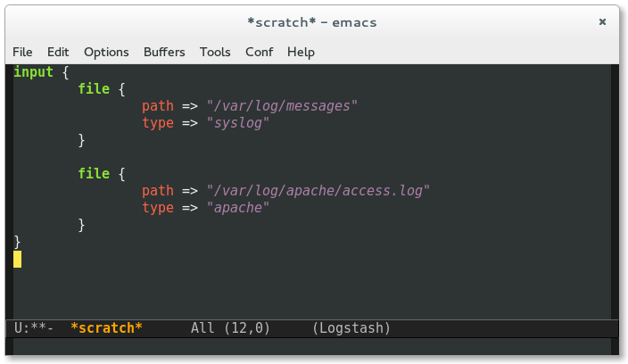

# logstash-conf-mode

A basic Emacs mode for editing Logstash configuration files.

Features:

* Syntax highlighting based on `conf-mode`.
* Indentation.

Just install it from MELPA, then run `M-x logstash-conf-mode` on the file.

## Changelog

### v0.4 (not yet tagged)

Fixed an issue with slow indentation on large files.

Ensure point stays on the same line when indenting.

### v0.3

Change default indentation to 4 spaces.

### v0.2

Initial release.
